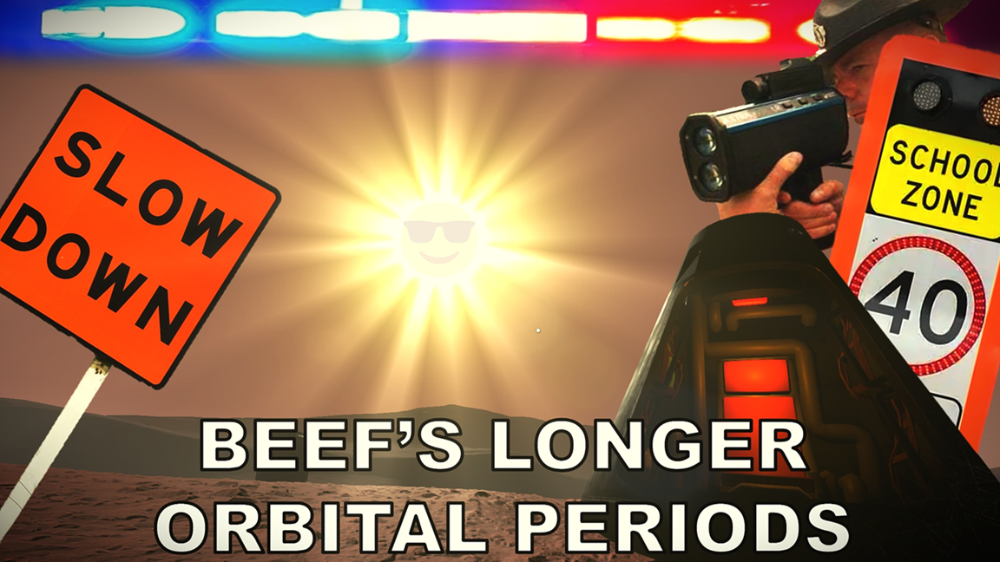

# Beef's Longer Orbital Periods

This plugin gives you control over the length of the day/night cycle in Stationeers. You can set it really fast, really slow, however you want.

It works as a server-side only mod, not requiring clients to have it installed. The mod automatically disables its patch if it detects you're connecting to someone else's world.

## Requirements

**WARNING:** This is a StationeersLaunchPad Plugin Mod. It requires BepInEx to be installed with the StationeersLaunchPad plugin.

See: [https://github.com/StationeersLaunchPad/StationeersLaunchPad](https://github.com/StationeersLaunchPad/StationeersLaunchPad)

## Installation

1.  Ensure you have BepInEx and StationeersLaunchPad installed.
2.  Install it from the workshop. Alternatively: Place the dll file into your `/BepInEx/plugins/` folder.

## Usage

You can configure the multiplier in the StationeersLaunchPad config, or you can set it in-game using the console. Changes made via the console are automatically saved to the config file and will persist between game sessions.

Press `F3` to open the console and use the `time` command.

### Commands

- `time` - Show current settings
- `time <multiplier>` - Set a custom multiplier
- `time real-moon` - 29.53x (~10 hours)
- `time real-mars` - 1.027x (~20.5 min)
- `time real-europa` - 3.551x (~1 hr 11 min)
- `time real-venus` - 116.75x (~39 hours)
- `time real-mimas` - 0.942x (~18.8 min)

### Examples

| Multiplier | Day Length |
|------------|------------|
| `time 0.5` | 10 minutes |
| `time 1.0` | 20 minutes (vanilla) |
| `time 3.0` | 1 hour (mod default) |
| `time 6.0` | 2 hours |

## Plant Scaling Options

By default, the mod does not affect plant growth or light/darkness requirements.

### Growth Speed Scaling
Three modes are available:
- Disabled - Vanilla plant growth speed
- UseDayLength - Plants grow slower by the same multiplier as day length
- Custom - Use a separate multiplier just for plant growth (29.53x plant growth speed would be just silly)

### Light/Dark Requirement Scaling

When enabled, plant light and darkness requirements per day are multiplied by the day length multiplier. Plants will need proportionally more light/dark time per longer day cycle.

### Commands

- `plants` - Show current plant settings
- `plants growth off` - Disable growth scaling (vanilla)
- `plants growth on` - Scale growth by day length
- `plants growth <value>` - Use custom growth multiplier
- `plants light on|off` - Toggle light/dark requirement scaling

## Notes
- This mod only affects the sun's orbital period and does not change the duration or frequency of storms.
- The orbital period change is server-side only - clients do not need the mod for day/night cycle changes (at least 90% sure).
- Plant scaling changes are currently applied (to the best of my knowledge) server-side only. If plant growth is not syncing correctly in multiplayer with plant scaling enabled, clients may also need the mod installed.

## Changelog

>### Version 3.0.0:
> - Add config options to menu
> - Add presets for moon, mars, europa, venus, and mimas
> - Add plant growth scaling (this can be set independently of day length if desired)
> - Add plant light/darkness scaling option

>### Version 2.0.0
>- Complete rewrite to update to current Stationeers
>- Added a console command system (`time [multiplier]`)
>- Console command changes are automatically saved to the config file

## Source Code

The source code is available on GitHub:
[https://github.com/TheRealBeef/Stationeers-Longer-Orbital-Periods](https://github.com/TheRealBeef/Stationeers-Longer-Orbital-Periods)